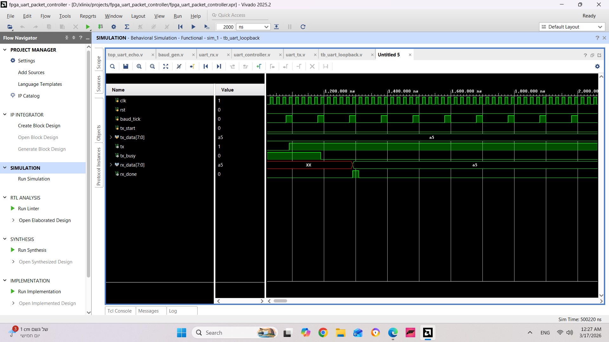

# FPGA UART Echo Controller

UART echo system implemented in Verilog using Xilinx Vivado.

## Description
This project implements a UART echo system on FPGA.

The system receives a byte using UART RX and sends the same byte back through UART TX.

## Architecture

Modules in the design:

- baud_gen – generates baud rate tick
- uart_tx – UART transmitter
- uart_rx – UART receiver
- uart_controller – FSM controlling the data flow
- top_uart_echo – top level integration module

## Tools

- Verilog
- Xilinx Vivado
- FPGA design flow
- RTL simulation

## Features

- UART serial communication
- FSM controller
- Modular RTL design
- Simulation testbench

- ## Simulation

